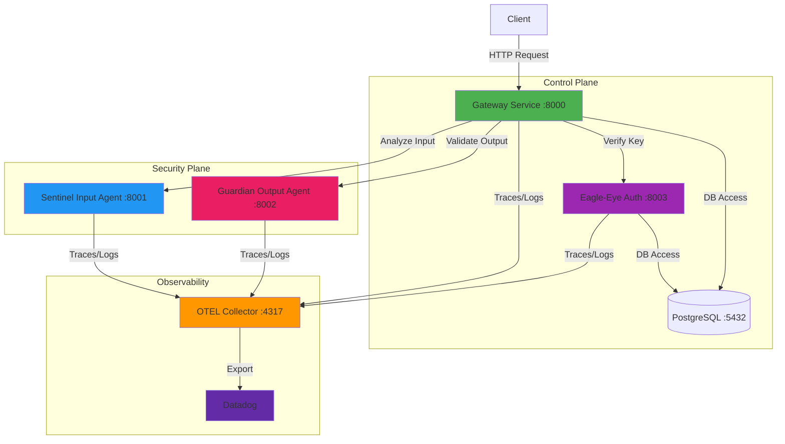
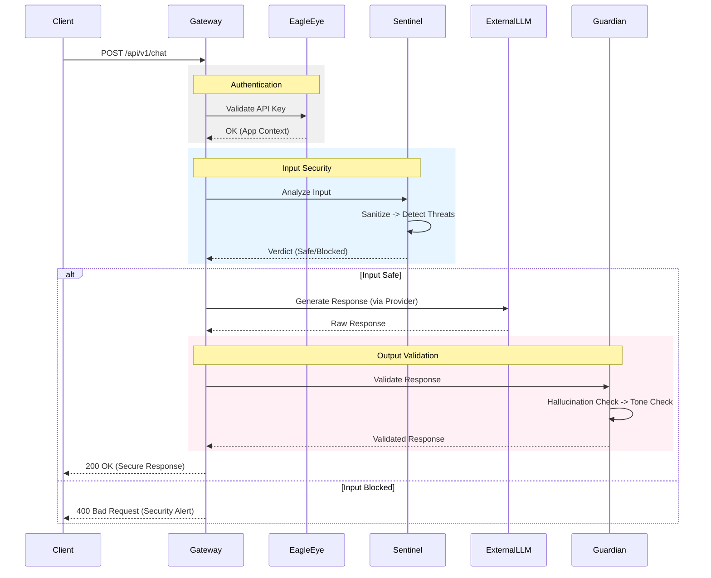

# Clestiq Shield - Agent Core

Production-grade FastAPI proxy service for LLM applications with **multi-layer security** and **distributed microservices**.

## 🛡️ Security Features

### Multi-Layer Defense Architecture

The system implements a **defense-in-depth** strategy with multiple security layers across distributed agents:

```
Request → Auth (Eagle-Eye) → Threat Detection (Sentinel) → LLM → Output Validation (Guardian) → Response
```

#### 1. **Authentication & Management** (Eagle-Eye)
- **API Key Validation**: Secure, hashed API key verification.
- **Application Management**: Multi-app support with distinct configurations.
- **User Management**: Role-based access control.

#### 2. **Input Security Assessment** (Sentinel)
- **Input Sanitization**: Unicode normalization, null byte removal, HTML escaping.
- **PII Redaction**: Auto-redaction of SSNs, emails, phone numbers, etc.
- **Threat Detection**:
    - **SQL Injection**: Pattern matching for common injection vectors.
    - **XSS**: Detection of malicious scripts and event handlers.
    - **Command Injection**: OS command detection.
- **LLM-Based Analysis**: Deep semantic analysis using Gemini Pro.
- **TOON Conversion**: Context-aware input transformation.

#### 3. **Output Validation** (Guardian)
- **Hallucination Detection**: Verifies LLM output against source facts.
- **Tone Analysis**: Ensures brand consistency and appropriate tone.
- **Toxicity Check**: Filters harmful or offensive content.
- **PII Leakage Prevention**: Double-check for sensitive data in responses.

### Configuration

Security features are configurable via environment variables in `docker-compose.yml`:

```bash
# Sentinel Settings
SECURITY_SANITIZATION_ENABLED=true
SECURITY_SQL_INJECTION_DETECTION_ENABLED=true
SECURITY_LLM_CHECK_THRESHOLD=0.85

# Guardian Settings
HARMFUL_CONTENT_THRESHOLD=0.7
INAPPROPRIATE_CONTENT_THRESHOLD=0.6
```

## 🚀 Quick Start

### Development

```bash
# Install dependencies (managed via Poetry in each service)
# Example for Gateway:
cd services/gateway
poetry install

# Run the full distributed system
docker-compose up --build
```

### Testing

Run the comprehensive security test suite in Docker:

**Windows (PowerShell):**
```powershell
.\run-tests.ps1
```

**Linux/Mac:**
```bash
chmod +x run-tests.sh
./run-tests.sh
```

## 🏗️ Architecture

### Distributed Microservices Architecture

Clestiq Shield is a **distributed system** with five specialized services:



#### Services

1. **Gateway Service** (`services/gateway/`)
   - **Port**: 8000
   - **Role**: Entry point, Orchestrator
   - **Responsibilities**: Request routing, authentication coordination, response aggregation.

2. **Eagle-Eye Service** (`services/eagle-eye/`)
   - **Port**: 8003
   - **Role**: Identity & Access Management (IAM)
   - **Responsibilities**: API Key generation/validation, User/App management.

3. **Sentinel Service** (`services/security-agent/`)
   - **Port**: 8001
   - **Role**: Input Security Agent
   - **Responsibilities**: Input sanitization, threat detection (SQLi, XSS), PII redaction, TOON conversion.
   - **Tech**: LangGraph, Gemini Pro.

4. **Guardian Service** (`services/guardian/`)
   - **Port**: 8002
   - **Role**: Output Validation Agent
   - **Responsibilities**: Hallucination detection, tone/toxicity checks, output cleanup.
   - **Tech**: LangGraph, Gemini Pro.

5. **OTEL Collector** (`services/otel-collector/`)
   - **Ports**: 4317 (gRPC), 4318 (HTTP)
   - **Role**: Telemetry Aggregator
   - **Responsibilities**: Collects and exports traces, metrics, and logs to Datadog.

### Request Flow



## 🔧 Technology Stack

- **Framework**: FastAPI (All services)
- **Language**: Python 3.11+
- **LLM**: Google Vertex AI (Gemini 2.5 Pro / 2.0 Flash)
- **Agent Framework**: LangChain + LangGraph
- **Database**: PostgreSQL (Asyncpg + SQLAlchemy)
- **Observability**: OpenTelemetry + Datadog
- **Security & Util Libraries**: 
  - `bleach` - HTML sanitization
  - `argon2-cffi` - Password hashing
  - `python-jose` - JWT handling
  - `structlog` - Structured logging
  - `email-validator` & `phonenumbers` - PII detection

## 📝 License

MIT License
