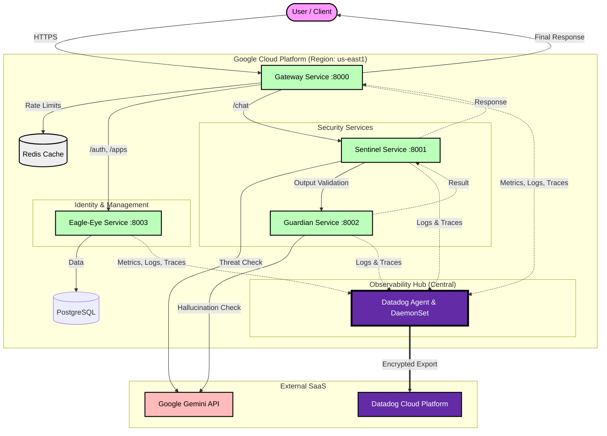
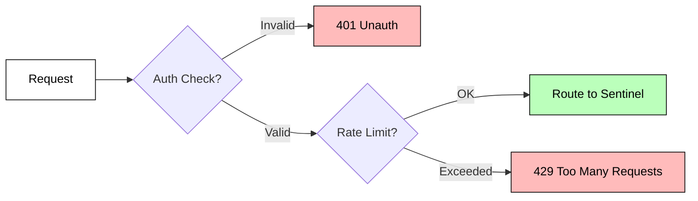
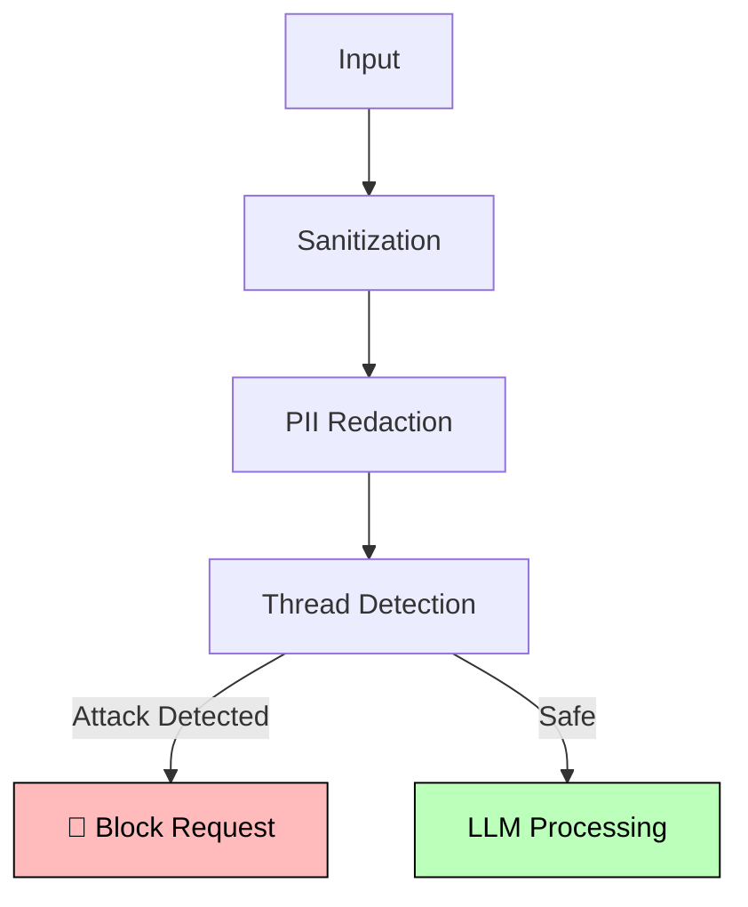
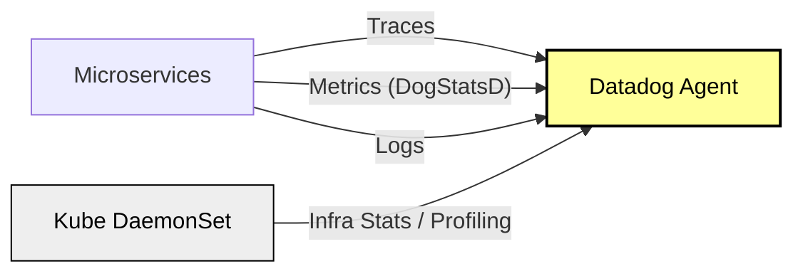

<div align="center">

```
 ██████╗██╗     ███████╗███████╗████████╗██╗ ██████╗     ███████╗██╗  ██╗██╗███████╗██╗     ██████╗ 
██╔════╝██║     ██╔════╝██╔════╝╚══██╔══╝██║██╔═══██╗    ██╔════╝██║  ██║██║██╔════╝██║     ██╔══██╗
██║     ██║     █████╗  ███████╗   ██║   ██║██║   ██║    ███████╗███████║██║█████╗  ██║     ██║  ██║
██║     ██║     ██╔══╝  ╚════██║   ██║   ██║██║▄▄ ██║    ╚════██║██╔══██║██║██╔══╝  ██║     ██║  ██║
╚██████╗███████╗███████╗███████║   ██║   ██║╚██████╔╝    ███████║██║  ██║██║███████╗███████╗██████╔╝
 ╚═════╝╚══════╝╚══════╝╚══════╝   ╚═╝   ╚═╝ ╚══▀▀═╝     ╚══════╝╚═╝  ╚═╝╚═╝╚══════╝╚══════╝╚═════╝ 
                                                                                                      
                            🛡️  AGENT CORE - AI Security Gateway  🛡️
                          Multi-Layer Defense for LLM Applications
```

[](/)
[](/)
[](/)
[](/)
[](/)

---

### 🎯 **Mission Statement**

**Production-grade, enterprise-ready AI Security Gateway providing comprehensive, multi-layered defense for Large Language Model applications through intelligent microservices that deliver real-time threat detection, input sanitization, output validation, and complete observability.**

---

</div>

## 📋 Table of Contents

- [🏗️ System Architecture](#-system-architecture)
- [📂 Repository Structure](#-repository-structure)
- [🔬 Service Deep Dive](#-service-deep-dive)
  - [1. Gateway Service](#1-gateway-service)
  - [2. Eagle-Eye (IAM)](#2-eagle-eye-iam)
  - [3. Sentinel (Input Security)](#3-sentinel-input-security)
  - [4. Guardian (Output Validation)](#4-guardian-output-validation)
- [🚀 Quick Start](#-quick-start)
- [📊 Observability](#-observability-datadog)

---

## 🏗️ System Architecture

Clestiq Shield protects your LLM applications using a **distributed microservices pattern**. Traffic flows through multiple security layers before reaching the LLM, and the response is validated before returning to the user.



---

## 📂 Repository Structure

The `services/` directory contains the independent microservices:

```bash
services/
├── 🌐 gateway/           # Entry point, Rate Limiting, Orchestration
├── 🔐 eagle-eye/         # Identity (IAM), Users, Apps, API Keys
├── 🎯 security-agent/    # "Sentinel": Input Security, PII, Threat Detection
└── 👁️ guardian/          # "Guardian": Output Validation, Hallucination, Toxicity
```

---

## 🔬 Service Deep Dive

### 1. Gateway Service
**Orchestrator & First Line of Defense**

The Gateway is the single entry point. It handles **Authentication enforcement** (delegating logic to Eagle-Eye) and **Rate Limiting** (using Redis) before routing requests to the security agents.

**Key Features:**
- 🛡️ **Rate Limiting**: Sliding window counters backed by Redis.
- 🔑 **Auth Enforcement**: Validates `X-API-Key` headers.
- 🚦 **Routing**: Directs traffic to Sentinel for inspection.
- 📊 **Telemetry**: Metric aggregation point.



### 2. Eagle-Eye (IAM)
**Identity & Access Management**

Manages the hierarchical relationship between **Users**, **Applications**, and **API Keys**. Use this service to generate keys for your clients.

**Key Features:**
- 🔐 **Argon2 Hashing**: Secure API key storage.
- 🏢 **Multi-Tenancy**: Users can own multiple Apps; Apps have multiple Keys.
- 🎫 **JWT Auth**: Bearer token authentication for management APIs.

### 3. Sentinel (Input Security)
**The "Security Agent" - Proactive Threat Defense**

Sentinel analyzes incoming prompts *before* they reach the LLM. It focuses on **Input Sanitization** and **Threat Detection**.

**Key Features:**
- 🧹 **Sanitization**: Strips dangerous HTML, optimizes Unicode.
- 🕵️ **PII Redaction**: Detects & masks SSNs, Emails, Phones, Credit Cards.
- 🛡️ **Threat Detection**: Blocks SQL Injection, XSS, Command Injection, and Jailbreak attempts.
- 🎭 **TOON Conversion**: Threat-Obfuscated Object Notation for safe processing.
- ⏭️ **LLM Forwarding**: Intelligent routing to allow or block LLM access based on threat level.



### 4. Guardian (Output Validation)
**The "Quality Agent" - Reactive Response Validation**

Guardian analyzes the LLM's response before it is returned to the user. It ensures the AI is helpful, harmless, and honest.

**Key Features:**
- 🤥 **Hallucination Detection**: Cross-references claims with knowledge base.
- ☢️ **Toxicity Check**: Filters hate speech and harmful content.
- 🏛️ **Tone Analysis**: Ensures brand-compliant response style.
- 📚 **Citation Verification**: Validates links and references.
- 🕵️ **PII Leak Detection**: Prevents sensitive data from leaking in LLM responses.
- 🛑 **False Refusal Detection**: Identifies when the LLM incorrectly refuses a safe prompt.
- 📝 **Structured Output**: Enforces valid JSON/TOON output formats.
- ⚠️ **Disclaimer Injection**: Adds necessary warnings or legal disclaimers.

---

## 🚀 Quick Start

### Prerequisites
- Docker & Docker Compose
- Google Gemini API Key
- Datadog API Key

### Run Locally

1. **Clone & Configure**
   ```bash
   git clone https://github.com/your-org/ClestiqShield-AgentCore.git
   cd ClestiqShield-AgentCore
   
   # Create .env from .env.example
   cp .env.example .env
   
   # ⚠️ IMPORTANT: Configure Datadog for Full Observability
   # Edit .env and add your Keys
   ```

2. **Start Services**
   ```bash
   docker-compose up --build -d
   ```

3. **Verify**
   ```bash
   curl http://localhost:8000/health
   ```

---

## 📊 Observability (Datadog)

All services are fully instrumented with **Datadog**.

- **APM**: Distributed tracing across all 4 microservices.
- **Metrics**: 
    - `clestiq.gateway.requests`
    - `clestiq.sentinel.threats_detected`
    - `clestiq.guardian.hallucinations`
- **Logs**: Structured JSON logging.


