# Clestiq Shield - Agent Core

Production-grade FastAPI proxy service for LLM applications with **multi-layer security**.

## 🛡️ Security Features

### Multi-Layer Defense Architecture

The security agent implements a **defense-in-depth** strategy with multiple security layers:

```
Request → Input Sanitization → PII Redaction → Threat Detection → LLM Analysis → Response
```

#### 1. **Input Sanitization** (On-Premise)
- Unicode normalization to prevent bypass attempts
- Null byte removal
- Path traversal detection
- HTML escaping for XSS prevention
- Length limiting to prevent DoS
- No external API calls required

#### 3. **PII Detection & Redaction** (On-Premise)
- **Automatically redacts sensitive data:**
  - Social Security Numbers (SSN)
  - Credit card numbers
  - Email addresses
  - Phone numbers
  - API keys and tokens
- Sensitive keyword detection (passwords, secrets, etc.)

#### 4. **Threat Detection** (On-Premise)
- **SQL Injection**: Pattern matching for UNION, SELECT, DROP, OR 1=1, etc.
- **XSS (Cross-Site Scripting)**: Script tags, event handlers, javascript: protocol
- **Command Injection**: Shell metacharacters, command chaining, dangerous commands
- **Path Traversal**: Directory traversal patterns (../, ..\, URL-encoded)
- Confidence scoring for detected threats

#### 5. **LLM-Based Security Analysis** (Vertex AI)
- Gemini 2.5 Pro for sophisticated threat detection
- Prompt injection detection
- Jailbreak attempt detection
- Malicious intent analysis
- Only called after passing on-premise checks

### Configuration

All security features are configurable via environment variables:

```bash
# Enable/disable security features
SECURITY_SANITIZATION_ENABLED=true
SECURITY_PII_REDACTION_ENABLED=true
# Threat detection configuration
SECURITY_XSS_PROTECTION_ENABLED=true
SECURITY_SQL_INJECTION_DETECTION_ENABLED=true
SECURITY_COMMAND_INJECTION_DETECTION_ENABLED=true

# LLM security threshold
SECURITY_LLM_CHECK_THRESHOLD=0.85
```

## 🚀 Quick Start

### Development

```bash
# Install dependencies
poetry install

# Run the application
docker-compose up
```

### Testing

Run the comprehensive security test suite in Docker:

**Windows (PowerShell):**
```powershell
.\run-tests.ps1
```

**Linux/Mac:**
```bash
chmod +x run-tests.sh
./run-tests.sh
```

**Manual Docker testing:**
```bash
docker-compose -f docker-compose.test.yml run --rm test pytest tests/agents/ -v
```

## 📊 Test Coverage

The security agent includes comprehensive tests:

- **Unit Tests**:
  - `test_sanitizers.py` - Input/output sanitization and PII redaction
  - `test_threat_detectors.py` - SQL injection, XSS, command injection detection
  - `test_threat_detectors.py` - SQL injection, XSS, command injection detection

- **Integration Tests**:
  - `test_security_integration.py` - End-to-end security flow

Run tests with coverage:
```bash
pytest tests/agents/ --cov=app.agents.nodes --cov-report=html
```

## 🏗️ Architecture

### Distributed Microservices Architecture

Clestiq Shield is now a **distributed system** with three main services:


#### Services

1. **Gateway Service** (`services/gateway/`)
   - Port: 8000
   - Handles client requests and authentication
   - Manages database connections
   - Routes requests to Security Agent
   - Instrumented with OTEL for tracing

2. **Security Agent Service** (`services/security-agent/`)
   - Port: 8001
   - Runs LangGraph security analysis workflow
   - Performs threat detection and PII redaction
   - Returns security verdicts
   - Instrumented with OTEL for tracing

3. **OTEL Collector** (`services/otel-collector/`)
   - Ports: 4317 (gRPC), 4318 (HTTP)
   - Collects traces, metrics, and logs from both services
   - Exports to Datadog for observability
   - Tracks latency per service

4. **PostgreSQL Database**
   - Port: 5432
   - Stores application and API key data
   - Only accessible by Gateway service

### Security Agent State

The `AgentState` tracks all security analysis results:

```python
class AgentState(TypedDict):
    input: Dict[str, Any]
    security_score: float
    is_blocked: bool
    block_reason: Optional[str]
    sanitized_input: Optional[str]
    sanitization_warnings: Optional[List[str]]
    pii_detections: Optional[List[Dict[str, Any]]]
    redacted_input: Optional[str]
    detected_threats: Optional[List[Dict[str, Any]]]
    client_ip: Optional[str]
    user_agent: Optional[str]
```

### Request Flow

```mermaid
sequenceDiagram
    participant Client
    participant Gateway
    participant Security
    participant OTEL
    participant Datadog

    Client->>Gateway: POST /api/v1/proxy
    activate Gateway
    Note over Gateway: Authenticate request
    
    Gateway->>Security: POST /analyze
    activate Security
    Note over Security: Run security graph
    Security->>Security: Sanitize → PII → Threats → LLM
    Security-->>Gateway: Security verdict
    deactivate Security
    
    alt Request Blocked
        Gateway-->>Client: 400 Bad Request
    else Request Allowed
        Gateway-->>Client: 200 OK
    end
    deactivate Gateway
    
    Gateway->>OTEL: Send traces & metrics
    Security->>OTEL: Send traces & metrics
    OTEL->>Datadog: Export telemetry
```



## 🔧 Technology Stack

- **Framework**: FastAPI
- **LLM**: Google Vertex AI (Gemini 2.5 Pro)
- **Agent Framework**: LangChain + LangGraph
- **Database**: PostgreSQL
- **Observability**: OpenTelemetry + Datadog
- **Security Libraries**: 
  - `bleach` - HTML sanitization
  - `email-validator` - Email validation
  - `phonenumbers` - Phone number detection

## 📝 License

MIT License
